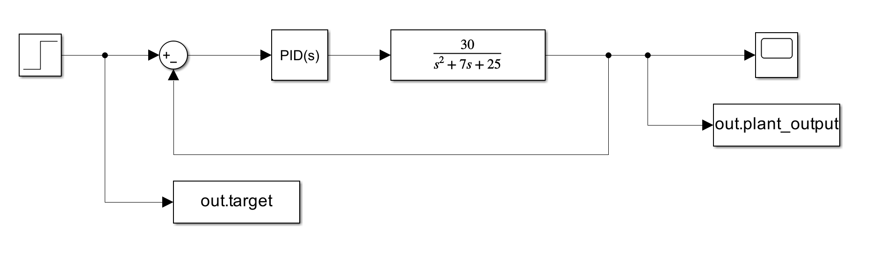
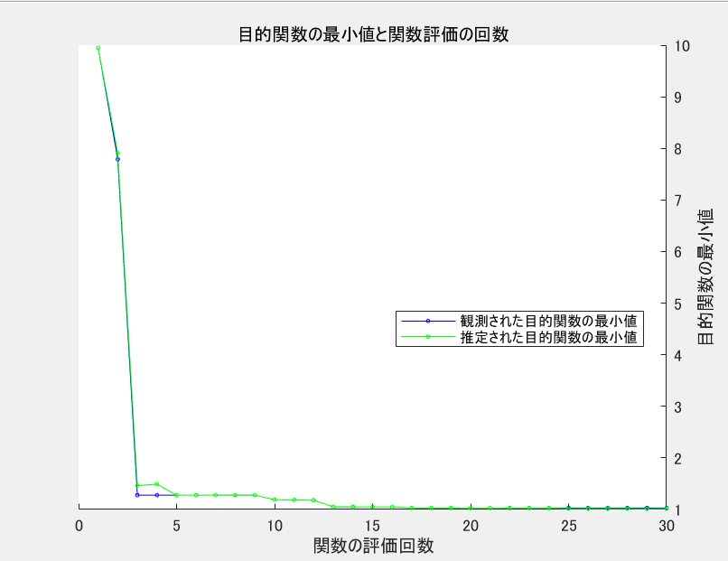
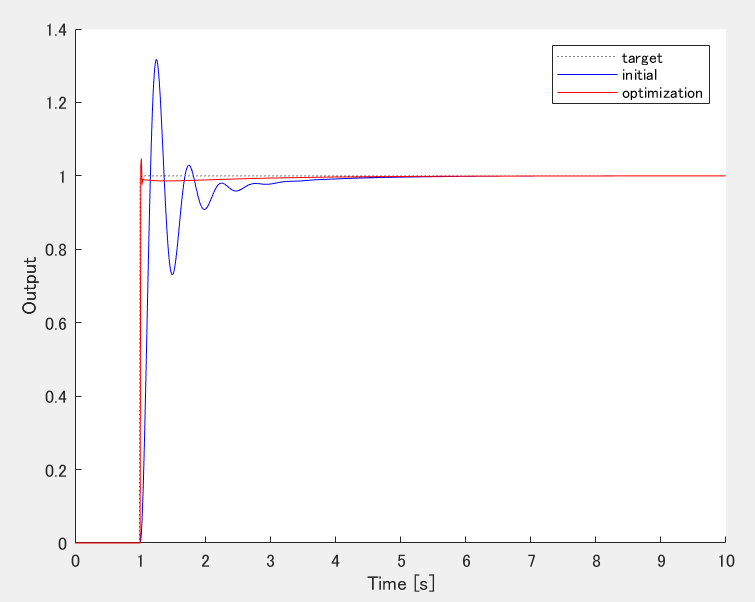

# MATLABとSimulinkを連携させてベイズ最適化を行うデモ

## 使い方

click on upper icon(open in MATLAB online).
And run ./bayes_example_main.m

## 内容

二次遅れ系に対するPID制御のパラメータの最適化．
ベイズ最適化を用いてパラメータ探索を行う．

## 結果例

初期応答と最適化後の応答

